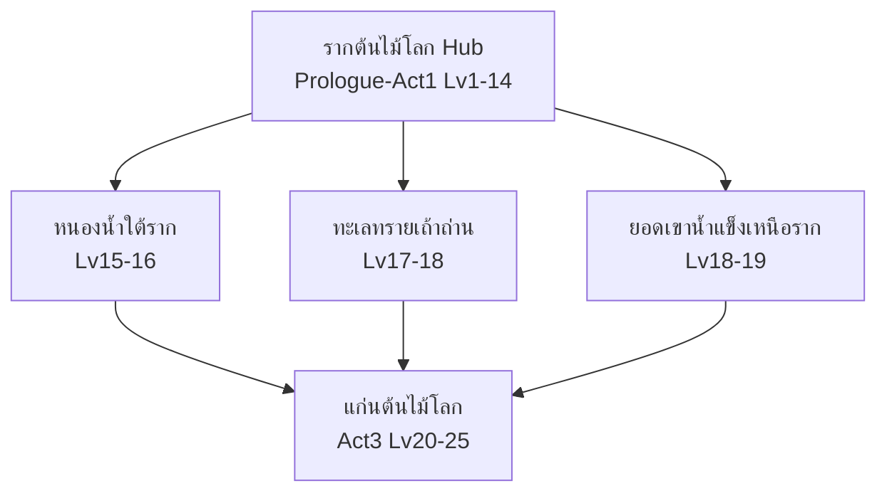

# ต้นไม้โลกกับยาแห่งชีวิต — Design Doc

2026-09-22 · @Someone

## Overview — แนวคิดหลักของเกม

**แนว:** Open World Action-Adventure ผสม Crafting/Diagnosis เชิงเภสัชศาสตร์

**Premise:** ต้นไม้โลก (World Tree) เป็นศูนย์กลางแผนที่และแหล่งกำเนิดพลังชีวิตของดินแดนทั้งหมด แต่กำลังป่วยด้วย **"ธุลีเน่า" (The Blight)** — โรคระบาดลึกลับที่กัดกินรากของต้นไม้โลก ทำให้สัตว์กลายพันธุ์ดุร้าย พืชพันธุ์เป็นพิษ และผู้คนล้มป่วยทั่วดินแดน

ตัวเอกคือ **"ผู้ตื่น"** ที่ถูกต้นไม้โลกเลือกให้ออกเดินทางค้นหาวิธีรักษา ธีมนี้ทำให้ความรู้ด้านเภสัชกรรม/เวชภัณฑ์เป็นหัวใจของทั้งเนื้อเรื่องและกลไกเกม ไม่ใช่แค่ระบบเสริม — ผู้เล่นต้องใช้ความรู้จริงเรื่องยา (dosage, drug interaction, toxicology) เพื่อเอาชนะทั้งเควสและบอส

**เป้าหมายการออกแบบ:** ให้ผู้เล่นได้เรียนรู้หลักเภสัชศาสตร์พื้นฐานที่ถูกต้อง ผ่านกลไกเกมที่สนุกและมีเหตุผลเชิงเหตุ-ผลจริง ไม่ใช่แค่ระบบไอเทมสุ่มทั่วไป

## ลิสต์ระบบหลักของเกม

1. **โลกและการสำรวจ (World & Exploration)** — ต้นไม้โลกเป็นศูนย์กลาง, แผนที่/ไบโอม, Day-Night Cycle, Fast Travel
2. **ตัวละคร (Character System)** — HP, Mana, Stamina, Stat หลัก, Skill Tree, ระบบเลเวลอัพ
3. **ต่อสู้ (Combat System)** — ประเภทการโจมตี, Buff/Debuff/สถานะ (พิษ/ติดเชื้อ), Boss Fight
4. **เควสและ NPC** — NPC ประจำจุด, Main/Side/Repeatable Quest, ระบบไดอะล็อก, Faction
5. **เภสัชกรรม/การปรุงยา** ⭐ — แกนความรู้หลักของเกม (รายละเอียดในหัวข้อถัดไป)
6. **ไอเทมและเศรษฐกิจ** — Inventory, Crafting นอกเหนือยา, เงินตรา/ร้านค้า, Equipment
7. **เนื้อเรื่อง (Narrative)** — Lore ต้นไม้โลก, Main Plot แบ่งเป็น Act, Lore สมุนไพร/ยา
8. **UI/UX** — HUD, หน้าจอเควส/Inventory/Skill Tree/Pharmacopedia, Save/Load
9. **ระบบอาชีพ (Class System)** — ปลดล็อกที่ Lv 10, 4 สายอาชีพ (รายละเอียดในหัวข้อถัดไป)

## ระบบเภสัชกรรม (Pharmacy System)

แบ่งองค์ความรู้จริงเป็น 4 แขนง ผูกเป็น Skill Branch ของแต่ละอาชีพ:

| แขนงวิชาจริง | ในเกมคือ | เนื้อหาที่สอน |
| --- | --- | --- |
| Pharmacognosy (เภสัชเวท) | สายเก็บวัตถุดิบ | รู้จักพืช/แร่/สัตว์ที่มีฤทธิ์ทางยา และสารออกฤทธิ์จริง |
| Pharmaceutics (เภสัชกรรม) | สายปรุงยา | วิธีสกัด-ผสม-ปรุงยาให้ใช้ได้จริง (ต้ม/หมัก/บด/สกัด) |
| Pharmacology (เภสัชวิทยา) | สายออกฤทธิ์ | กลไกการออกฤทธิ์ของยาในร่างกาย |
| Toxicology (พิษวิทยา) | สายแก้พิษ | ขนาดยา ความเป็นพิษ ยาแก้พิษเฉพาะ |

### ระบบย่อย

1. **ระบบวัตถุดิบ (Ingredient System)** — ทุกวัตถุดิบมีสารออกฤทธิ์อ้างอิงของจริง และค่า Potency ต่างกันตามแหล่งเก็บ (อายุพืช, ฤดูกาล, ไบโอม)
2. **วิธีเตรียมยา (Preparation Method)** — ต้ม/สกัดน้ำ, หมักแอลกอฮอล์, บดผง, สกัดฉีด — เลือกผิดวิธีได้ยาฤทธิ์อ่อนลงหรือไม่ออกฤทธิ์เลย
3. **เภสัชจลนศาสตร์แบบย่อ (Simplified ADME)** — Onset Time, Duration (อิง Half-life จริง), Bioavailability
4. **ขนาดยาและ Therapeutic Index (TI)** — TI = Toxic Dose / Effective Dose แสดงเป็นแถบกราฟ 3 โซน: ไม่ออกฤทธิ์ → Therapeutic Window → เป็นพิษ
5. **ปฏิกิริยาระหว่างยา** — Synergism (เสริมฤทธิ์ = คอมโบ), Antagonism (หักล้าง = กลไกยาแก้พิษ), Potentiation (เสริมแต่ไม่ออกฤทธิ์เอง)
6. **พิษวิทยาและการแก้พิษ (Antidote System)** — พิษแต่ละชนิดมีกลไกจำเพาะ ต้องใช้ Antidote ที่ตรงกลไก (เช่น Receptor Antagonist, Chelation)
7. **ระบบวินิจฉัยอาการ (Diagnosis Quest System)** — NPC ป่วยมี Symptom Cluster ต้องอนุมานโรคแล้วเลือกยาตรงกลไก
8. **Pharmacopedia** — สารานุกรมยาในเกม บันทึกกลไก, TI, ผลข้างเคียง, ประวัติการค้นพบยาโลกจริง

## เนื้อเรื่องหลักและตรรกะเลเวล (Lv 1-25)

| Act | เลเวล | ธีมหลัก | สถานะอาชีพ |
| --- | --- | --- | --- |
| บทนำ: ผู้ตื่น | 1-9 | ตื่นที่ต้นไม้โลก เรียนรู้พื้นฐาน | ยังไม่มีอาชีพ |
| Act 1: พิธีเลือกเส้นทาง | 10-14 | เลือกอาชีพ + ปูพื้นฐานสกิล | เพิ่งได้อาชีพ |
| Act 2: รากที่แตกร้าว | 15-19 | สำรวจ 3 ไบโอม สืบต้นตอธุลีเน่า | อาชีพเริ่มแข็งแกร่ง |
| Act 3: ยาแห่งความจริง | 20-25 | เผชิญหน้าต้นตอโรค + บอสใหญ่ | อาชีพเต็มรูปแบบ |

### บทนำ: ผู้ตื่น (Lv 1-9)

ตื่นที่รากต้นไม้โลกโดยจำอดีตไม่ได้ ต่อสู้ด้วยมือเปล่า/อาวุธพื้นฐาน ยังไม่มีสกิลพิเศษ เควสหลักพาไปรู้จัก NPC 4 คนตรงรากทั้ง 4 (ตัวแทนอาชีพ) ปิดท้ายด้วยธุลีเน่าโจมตีหมู่บ้าน เป็นแรงผลักดันให้เลือกเส้นทางจริงจัง

**ตรรกะเลเวล:** อัพเร็ว โค้ง XP เกือบเชิงเส้น จากเควสหลัก \~8-10 เควส + ฟาร์มเล็กน้อย เพื่อไม่ให้อึดอัดก่อนได้อาชีพ

### Act 1: พิธีเลือกเส้นทาง (Lv 10-14)

พิธี "รากทั้งสี่" ให้ทดลองอาชีพก่อนเลือกจริง ได้สกิลตัวแรกทันที + เควสบททดสอบอาชีพ ปลดล็อกสกิลที่ 2 ที่ Lv 13 เนื้อเรื่องเริ่มสืบว่าธุลีเน่าไม่ใช่โรคธรรมชาติ

**ตรรกะเลเวล:** โค้ง soft-exponential ผสมเควสหลักกับเควสฝึกสกิล/คราฟต์

### Act 2: รากที่แตกร้าว (Lv 15-19)

เปิด 3 ไบโอมใหม่ แต่ละที่มีสาเหตุธุลีเน่าเฉพาะจุด + NPC ป่วยให้วินิจฉัยอาการ ปลดล็อกสกิลที่ 3 (Lv16), สกิลที่ 4 (Lv19) เนื้อเรื่องพบว่าผู้สร้างธุลีเน่าเคยพยายามใช้ยาควบคุมธรรมชาติทั้งโลก

**ตรรกะเลเวล:** เควสวินิจฉัยอาการให้ XP ก้อนใหญ่กว่าฟาร์ม เพื่อจูงใจให้ผู้เล่นคิดมากกว่าฟาร์ม

### Act 3: ยาแห่งความจริง (Lv 20-25)

รวบรวมทีม NPC ทั้ง 4 สายอาชีพเดินทางสู่แก่นต้นไม้โลก ปลดล็อกสกิลไม้ตาย (Lv22) บอสท้ายบท (Lv25) เอาชนะด้วยความรู้ยาเท่านั้น จบ Act ด้วยจุดเปลี่ยนใหญ่เปิดทางสู่เนื้อเรื่องถัดไป

**ตรรกะเลเวล:** โค้ง XP ชันที่สุด เควสหลักให้ XP เป็นสัดส่วนหลัก บังคับให้เดินตามเนื้อเรื่องในจุดไคลแมกซ์

## ระบบอาชีพ (Class System) — ปลดล็อกที่ Lv 10

ปลดล็อกลำดับสกิล: **Lv10 → Lv13 → Lv16 → Lv19 → Lv22 (Ultimate)**. Mana Pool อ้างอิง: เริ่ม 60 (Lv10) เพิ่ม \~12/เลเวล ถึง Lv25 \~240

### 4 อาชีพให้เลือก

| อาชีพ | สไตล์ | แขนงเภสัชที่เน้น |
| --- | --- | --- |
| นักปรุงยา (Alchemist) | Support/Crafting | Pharmaceutics |
| หมอสนาม (Field Medic) | Healer | Pharmacology |
| นักพิษวิทยา (Toxicologist) | Damage Dealer (DOT) | Toxicology |
| นักรบพฤกษา (Herb Vanguard) | Tank/Melee | Pharmacognosy |

### 🧪 นักปรุงยา (Alchemist)

| Lv | สกิล | Mana Cost | Cooldown | หมายเหตุ |
| --- | --- | --- | --- | --- |
| 10 | กลั่นเร่งด่วน | 20 | 8 วิ | ปรุงยาทันทีกลางสนามรบ |
| 13 | สูตรเข้มข้น | 25 | 15 วิ | เพิ่ม Potency ของยาที่ปรุงต่อไปชั่วคราว |
| 16 | การกระจายฤทธิ์ | 35 | 20 วิ | แปลงยาเดี่ยวเป็น AoE |
| 19 | สมดุลปฏิกิริยา | 10/ครั้ง | ไม่มี | ป้องกัน Adverse Reaction จากผสมยาผิดคู่ |
| 22 ★ | ห้องทดลองเคลื่อนที่ | 80 | 90 วิ | สร้างพื้นที่ปรุงยาให้ทั้งทีมกลางการต่อสู้ |

### 🩹 หมอสนาม (Field Medic)

| Lv | สกิล | Mana Cost | Cooldown | หมายเหตุ |
| --- | --- | --- | --- | --- |
| 10 | ปฐมพยาบาลฉับไว | 25 | 10 วิ | รักษา HP ทันทีด้วย Mana |
| 13 | คลายพิษ | 20 | 15 วิ | ล้างสถานะผิดปกติทันที |
| 16 | กระตุ้นภูมิคุ้มกัน | 30 | 25 วิ | บัฟต้านทานสถานะผิดปกติให้ทีม |
| 19 | วิเคราะห์อาการเร่งด่วน | 15 | 5 วิ | สแกนเห็นอาการ/จุดอ่อนจริงทันที |
| 22 ★ | ปาฏิหาริย์แห่งชีพจร | 100 | 1 ครั้ง/ไฟต์ | ชุบชีวิตตัวเองหรือเพื่อน |

### ☠️ นักพิษวิทยา (Toxicologist)

| Lv | สกิล | Mana Cost | Cooldown | หมายเหตุ |
| --- | --- | --- | --- | --- |
| 10 | เข็มพิษ | 15 | 6 วิ | โจมตีติดพิษ DOT |
| 13 | วิเคราะห์จุดอ่อน | 10 | 8 วิ | ระบุจุดอ่อนศัตรูต่อพิษแต่ละชนิด |
| 16 | พิษสะสม | 0 | ไม่มี | Passive Stack พิษซ้อน |
| 19 | ดื้อพิษตนเอง | 20 | 30 วิ | แลก HP เพื่อพลังพิษแรงขึ้น |
| 22 ★ | ระบาดวิทยา | 90 | 90 วิ | ปล่อยพิษ AoE ลามต่อเนื่อง |

### 🌿 นักรบพฤกษา (Herb Vanguard)

| Lv | สกิล | Mana Cost | Cooldown | หมายเหตุ |
| --- | --- | --- | --- | --- |
| 10 | เกราะรากไม้ | 20 | 12 วิ | เกราะดูดซับดาเมจชั่วคราว |
| 13 | สารสกัดพลังกาย | 25 | 20 วิ | เพิ่ม STR/HP ชั่วคราวก่อนปะทะ |
| 16 | หนามป้องกัน | 5/วิ (Toggle) | ไม่มี | สะท้อนดาเมจเมื่อโดนตี |
| 19 | รากยึดเหนี่ยว | 30 | 18 วิ | ตรึงศัตรูกับพื้น |
| 22 ★ | ป่าเกิดใหม่ | 85 | 100 วิ | ฟื้น HP/Mana ต่อเนื่องให้ทีมในวง |

## ตาราง XP ต่อเลเวล (1-25)

โค้ง XP ไล่ระดับตาม Act: Prologue เกือบเชิงเส้น → Act 1 soft-exponential → Act 2 กระโดดขึ้นเพราะเควสวินิจฉัยอาการให้ XP ก้อนใหญ่ → Act 3 ชันสุด บังคับพึ่งเนื้อเรื่องมากกว่าฟาร์ม

| Lv | XP (Lv→Lv+1) | XP สะสม | Act | แหล่ง XP หลัก |
| --- | --- | --- | --- | --- |
| 1→2 | 100 | 100 | บทนำ | เควสหลัก |
| 2→3 | 150 | 250 | บทนำ | เควสหลัก |
| 3→4 | 220 | 470 | บทนำ | เควส + ฟาร์มเล็กน้อย |
| 4→5 | 300 | 770 | บทนำ | เควส + ฟาร์ม |
| 5→6 | 400 | 1,170 | บทนำ | ฟาร์ม/เควสรอง |
| 6→7 | 520 | 1,690 | บทนำ | ฟาร์ม/เควสรอง |
| 7→8 | 660 | 2,350 | บทนำ | ฟาร์ม/เควสรอง |
| 8→9 | 820 | 3,170 | บทนำ | ฟาร์ม/เควสรอง |
| 9→10 | 1,000 | 4,170 | บทนำ→Act1 | เควสหลัก (พิธีเลือกเส้นทาง) |
| 10→11 | 1,300 | 5,470 | Act 1 | เควสฝึกสกิล + ฟาร์ม |
| 11→12 | 1,650 | 7,120 | Act 1 | เควสฝึกสกิล + ฟาร์ม |
| 12→13 | 2,050 | 9,170 | Act 1 | เควสหลัก (สกิล 2) |
| 13→14 | 2,500 | 11,670 | Act 1 | ผสมเควส/ฟาร์ม |
| 14→15 | 3,000 | 14,670 | Act 1→2 | เควสหลัก |
| 15→16 | 3,800 | 18,470 | Act 2 | เควส Diagnosis (ก้อนใหญ่) |
| 16→17 | 4,700 | 23,170 | Act 2 | เควส Diagnosis + สกิล 3 |
| 17→18 | 5,700 | 28,870 | Act 2 | เควส Diagnosis |
| 18→19 | 6,800 | 35,670 | Act 2 | เควสหลัก (สกิล 4) |
| 19→20 | 8,000 | 43,670 | Act 2→3 | เควสหลัก |
| 20→21 | 10,000 | 53,670 | Act 3 | เควสหลักเป็นหลัก |
| 21→22 | 12,500 | 66,170 | Act 3 | เควสหลัก (สกิล Ultimate) |
| 22→23 | 15,500 | 81,670 | Act 3 | เควสหลัก |
| 23→24 | 19,000 | 100,670 | Act 3 | เควสหลัก |
| 24→25 | 23,000 | 123,670 | Act 3 | บอสท้ายบท |

## สูตรคำนวณ Onset / Duration

### สูตรอ้างอิงจริง (One-Compartment PK Model)

```latex
C(t) = \frac{Dose \times F \times k_a}{V_d \times (k_a - k_e)} \times (e^{-k_e t} - e^{-k_a t})
```

โดยที่ `Dose` = ขนาดยา, `F` = Bioavailability (0-1), `k_a` = Absorption rate, `k_e = ln(2)/half\_life`, `V_d` = Volume of distribution, `C(t)` = ความเข้มข้นในเลือด ณ เวลา t

**Onset** = เวลาที่ C(t) ไต่ถึง ED · **Duration** = ช่วงเวลาที่ C(t) อยู่เหนือ ED · **พิษ** = ถ้า C(t) เกิน TD

### สูตรย่อสำหรับเกม

```javascript
const ROUTE_PROFILE = {
  injection:  { speedFactor: 6.0, bioavailability: 1.00 },
  sublingual: { speedFactor: 3.5, bioavailability: 0.80 },
  oral:       { speedFactor: 1.0, bioavailability: 0.50 },
  topical:    { speedFactor: 0.4, bioavailability: 0.30 },
};

function getEffectiveDose(rawDose, route) {
  return rawDose * ROUTE_PROFILE[route].bioavailability;
}

function calculateOnset(baseOnsetSeconds, route, potency) {
  const speed = ROUTE_PROFILE[route].speedFactor;
  return baseOnsetSeconds / speed / potency;
}

function calculateDuration(halfLifeSeconds, doseRatio) {
  const ke = Math.log(2) / halfLifeSeconds;
  return Math.log(doseRatio) / ke;
}

function getEffectZone(effectiveDose, ED, TD) {
  if (effectiveDose < ED) return "NO_EFFECT";
  if (effectiveDose <= TD) return "THERAPEUTIC";
  return "TOXIC";
}
```

ข้อสังเกตสำคัญ: ถ้า `doseRatio = 1.0` (ให้พอดี ED) จะได้ duration = 0 ตรงกับหลักจริง — เกมควรออกแบบให้ผู้เล่นให้เกิน ED เล็กน้อยเสมอเพื่อให้มี duration ใช้งานได้ ซึ่งสอนหลัก MEC (Minimum Effective Concentration) ที่ถูกต้อง

## ตาราง ED/TD ของสาร 8 ชนิด

| วัตถุดิบในเกม | สารออกฤทธิ์จริง | ED | TD | TI | ความเสี่ยง | บทบาทในเกม |
| --- | --- | --- | --- | --- | --- | --- |
| เปลือกต้นหลิว | Salicin (บรรพบุรุษ Aspirin) | \~325-650 มก. | \~150 มก./กก. | กว้าง (\~10-15x) | ต่ำ | ยาเริ่มต้นผู้เล่นใหม่ |
| เห็ดรา Penicillium | Penicillin | 500 มก.-2 ก./วัน | สูงมาก | กว้างมาก (>100x) | ต่ำสุด | สอนพื้นฐานการปรุงยา |
| เมล็ดกาแฟ/กัวรานา | Caffeine | 100-200 มก. | \~150-200 มก./กก. | กว้างมาก | ต่ำ | สกิลบัฟความเร็ว |
| ต้นซิงโคนา | Quinine | \~600 มก. | >2 ก. | ปานกลาง (\~3-13x) | กลาง | รักษาโรคระบาดในเควส Diagnosis |
| ดอกเบลลาดอนนา | Atropine | 0.5-1 มก. | \~5-10 มก. | แคบ-ปานกลาง (\~5-10x) | กลาง-สูง | ยาแก้พิษเฉพาะทาง (Receptor Antagonist) |
| ฝิ่น/ดอกป๊อปปี้ | Morphine | \~10 มก. | \~200 มก. | ปานกลางแต่ถือว่าแคบ (กดการหายใจ) | สูง | ยาแก้ปวดรุนแรง |
| หญ้าคลาวเวอร์ขึ้นรา | Coumarin → Warfarin | \~2-10 มก./วัน | ขอบเขตแคบมาก | แคบ | สูงมาก | สอนเรื่องคำนวณเฉพาะบุคคล |
| ดอกฟ็อกซ์โกลฟ | Digoxin | 0.5-2.0 ng/mL | >2.0-2.5 ng/mL | แคบที่สุด (\~2x) | อันตรายสุด | วัตถุดิบบอสท้ายบท Lv 20-25 |

เรียงง่าย→ยากตาม TI สอดคล้องกับ Act: Penicillin/Caffeine ใช้ได้ตั้งแต่ Act 1, Digoxin ผูกกับไคลแมกซ์ Act 3 เป็นวัตถุดิบด่านสุดท้ายที่ต้องคำนวณละเอียดที่สุด

## ตัวอย่างเควสวินิจฉัยอาการ (Diagnosis Quest)

### เควสที่ 1: "ไข้ข้อบวมแห่งรากตะวันออก" (Act 1, Lv 11-12)

**NPC:** ช่างตีเหล็ก "โกรัน" เดินไม่ได้เพราะข้อเข่าบวม

**อาการ:** ข้อบวมแดงร้อน, ปวดเวลาขยับ, ไม่มีไข้สูง, ไม่มีบาดแผลภายนอก

**วินิจฉัย:** อาการอักเสบเฉพาะที่ ไม่ใช่การติดเชื้อ → ต้องการยาลดการอักเสบ **คำตอบ:** เปลือกต้นหลิว (Salicin ยับยั้งเอนไซม์สร้างสารก่อการอักเสบ) — TI กว้างสุด เหมาะเป็นเควสสอนพื้นฐาน **เลือกผิด** (เช่นยาฆ่าเชื้อ): อาการไม่ดีขึ้น ไม่ลงโทษหนัก **ผูกเนื้อเรื่อง:** เควสแรกที่ทำให้สังเกตว่าธุลีเน่าทำให้อักเสบผิดปกติกว่าธรรมดา

### เควสที่ 2: "ไข้จับสั่นแห่งหนองน้ำใต้ราก" (Act 2, Lv 16-17)

**NPC:** ชาวประมง 3 คนล้มป่วยพร้อมกัน

**อาการ:** ไข้ขึ้น-ลงเป็นรอบ (4-6 ชม.) สลับหนาวสั่น, เหงื่อออกมากตอนไข้ลด, เกิดเฉพาะคนใกล้น้ำนิ่ง

**วินิจฉัย:** รูปแบบไข้เป็นรอบ + จำกัดพื้นที่น้ำนิ่ง → ชี้ไปโรคที่มีพาหะ (ยุง) **คำตอบ:** เปลือกต้นซิงโคนา (Quinine) ให้ต่อเนื่องหลายวัน — ต้องคำนวณ Duration เพราะ TI ปานกลาง **ให้เกินขนาด:** เกิด Cinchonism (หูอื้อ ตาพร่า) ชั่วคราว **ให้น้อย/หยุดก่อนครบ:** ไข้กลับมาใหม่ สอนเรื่อง "กินยาให้ครบคอร์ส" **ผูกเนื้อเรื่อง:** เผยว่าธุลีเน่าทำให้พาหะแพร่โรครุนแรงขึ้น เป็นเงื่อนงำแรกสู่ผู้สร้างธุลีเน่า

### เควสที่ 3: "พิษเงาแห่งผู้ล่าราก" (Act 3, Lv 20-21)

**NPC:** สหายร่วมทีมโดนพิษจากสัตว์กลายพันธุ์ปนเปื้อนธุลีเน่า

**อาการ:** รูม่านตาหด, น้ำลายไหลมาก เหงื่อท่วมตัว, กล้ามเนื้อกระตุก หายใจลำบาก

**วินิจฉัย:** ตรงกับ Cholinergic Crisis — ต้องใช้สารบล็อก receptor ไม่ใช่สารกระตุ้นเพิ่ม **คำตอบ:** ดอกเบลลาดอนนา → Atropine (Receptor Antagonist) — TI แคบ-ปานกลาง ต้องคำนวณไม่ให้เกินจนเป็นพิษซ้อน **เลือกผิดกลไก:** อาการทรุดหนักขึ้นทันที **ผูกเนื้อเรื่อง:** ด่านฝึกซ้อมกลไก Antagonism ก่อนใช้ระดับสูงขึ้นในบอส Digoxin ที่ Lv 25

## บอสท้ายบท: "แก่นหัวใจแห่งรากเน่า" (Lv 25)

### Lore

แก่นกลางของต้นไม้โลกคือ "หัวใจ" ที่สูบฉีดพลังชีวิตไปทั่วดินแดน ธุลีเน่าได้แทรกซึมเข้าไปทำให้จังหวะการเต้นของหัวใจต้นไม้โลกปั่นป่วน (คล้าย Cardiac Arrhythmia) — ยิ่งโจมตีด้วยกำลังตรง ๆ ยิ่งทำให้จังหวะยุ่งเหยิงกว่าเดิม เพราะนี่ไม่ใช่ศัตรูที่เอาชนะด้วยดาเมจได้ แต่ต้องรักษาด้วย **Digoxin จากดอกฟ็อกซ์โกลฟ** ที่เก็บสะสมมาตลอด Act 3 — สารที่มี TI แคบที่สุดในเกม (\~2x) ทำให้ด่านนี้เป็นบททดสอบสุดท้ายของทุกระบบที่ผู้เล่นเรียนมา

### โครงสร้างการต่อสู้ 4 เฟส

**เฟส 1 — เปลือกนอก (100%-70% HP):** ต่อสู้ปกติกับรากเน่าและสัตว์กลายพันธุ์ที่ปกป้องแก่นกลาง ทุกอาชีพใช้สกิลต่อสู้ปกติได้เต็มที่ เมื่อ HP ถึง 70% แก่นหัวใจถูกเปิดออก

**เฟส 2 — วินิจฉัยจังหวะ (Heart Rhythm Exposed):** ปรากฏแถบ "จังหวะหัวใจ" ที่แกว่งไม่แน่นอน — ยิ่งโดนโจมตีตรง ๆ ยิ่งแกว่งแรงขึ้น (ลงโทษการตีมั่ว) ผู้เล่นต้องหยุดตีแล้วใช้สกิล **วิเคราะห์อาการเร่งด่วน (Field Medic)** เพื่ออ่านค่าจังหวะปัจจุบันแบบตัวเลข

**เฟส 3 — คาลิเบรตขนาดยา (Calibration Window):** หน้าต่างเวลาจำกัด (\~10 วิ) ให้ **นักปรุงยา (Alchemist)** เตรียมสารสกัด Digoxin แบบฉีด (onset เร็วสุดตามตาราง Route) จากฟ็อกซ์โกลฟที่เก็บมา แล้วฉีดขนาดที่คำนวณจาก ED/TD จริง:

- **ให้ถูกช่วง (เข้า Therapeutic Window):** จังหวะหัวใจนิ่งลง แก่นกลางเข้าสถานะเปราะบาง เปิดหน้าต่างดาเมจก้อนใหญ่
- **ให้เกิน TD (Overdose):** เกิด Toxic Backlash — ปาร์ตี้โดนดาเมจ และแก่นกลางฟื้น HP บางส่วน จังหวะยิ่งปั่นป่วนกว่าเดิม ต้องคาลิเบรตใหม่ในช่วงแคบลง (ลงโทษการประมาท)
- **ให้ต่ำกว่า ED (Underdose):** ไม่มีผลอะไรเปลี่ยนแปลง เสียเวลาช่วงคาลิเบรตไปฟรี ระหว่างนี้บอสโจมตีแรงขึ้น (Enrage ชั่วคราว)

**เฟส 4 — เผชิญหน้าแก่นแท้ (ต่ำกว่า 40% HP):** วนเฟส 2-3 อีก 2 รอบ โดยหน้าต่าง Therapeutic Window แคบลงเรื่อย ๆ ทุกรอบ (จำลองว่าหัวใจอ่อนแอลง ความคลาดเคลื่อนที่ยอมรับได้น้อยลง) รวมทั้งหมด 3 รอบคาลิเบรตตลอดการต่อสู้ — ผ่านครบ 3 รอบ = แก่นหัวใจกลับมาเต้นปกติ เปิดทางให้โจมตีขั้นสุดท้ายจบการต่อสู้

### บทบาทของแต่ละอาชีพในไฟต์นี้

| อาชีพ | หน้าที่เฉพาะในบอสนี้ |
| --- | --- |
| นักปรุงยา (Alchemist) | เตรียมสารฉีด Digoxin ความเข้มข้นแม่นยำ ใช้ "สมดุลปฏิกิริยา" ป้องกัน Adverse Reaction ระหว่างคาลิเบรต |
| หมอสนาม (Field Medic) | อ่านค่าจังหวะหัวใจด้วย "วิเคราะห์อาการเร่งด่วน" และรักษาปาร์ตี้ระหว่าง Toxic Backlash |
| นักพิษวิทยา (Toxicologist) | ใช้ความรู้ Antagonism ช่วยลดผลจาก Toxic Backlash ถ้าคาลิเบรตพลาด |
| นักรบพฤกษา (Herb Vanguard) | แทงค์ปกป้องทีมระหว่างหน้าต่างคาลิเบรต 10 วินาทีที่ทุกคนหยุดโจมตี |

### เหตุผลการออกแบบ

ด่านนี้บังคับให้ผู้เล่นใช้ทั้ง 4 แขนงความรู้เภสัชศาสตร์ที่สะสมมาตลอดเกมพร้อมกัน (ไม่ใช่แค่สาย Toxicity ของ Digoxin เท่านั้น) — ตีอย่างเดียวไม่มีทางชนะ เพราะยิ่งตียิ่งแย่ลง เป็นการปิดท้าย Act 3 ด้วยธีม "ความรู้ที่ถูกต้องเอาชนะกำลังดิบ" ตรงกับแก่นเรื่องทั้งเกม

## การตัดสินใจเชิงโครงสร้าง

### Party Composition → Single-player + Companion NPC

ผู้เล่นเลือก 1 อาชีพตอน Lv10 แต่ระหว่าง Act 2 จะรับสมัคร **NPC ตัวแทนอาชีพอีก 3 สาย** เข้าร่วมทีมทีละคนผ่านเควส (สอดคล้องกับ Act 3 ที่ "รวบรวมทีม NPC ทั้ง 4 สายอาชีพ") Companion คุมด้วย AI พื้นฐาน สั่งการผ่าน Radial Menu (โจมตี/รักษา/รอ) — ไม่ต้องทำ Multiplayer จริง ลดงบ implementation แต่ยังคงกลไกบอสที่ต้องใช้ 4 บทบาทพร้อมกันได้

### Combat Style → Real-time Action

สอดคล้องกับสูตร Stat ที่มี Crit%/Evasion% และแนว Open World Action-Adventure ที่วางไว้ตั้งแต่ Overview เฟสคาลิเบรตขนาดยาในบอสเป็นมินิเกมกด-ค้างแบบเรียลไทม์ (ลากตัวชี้ให้อยู่ใน Therapeutic Window ที่ขยับตำแหน่งได้ ไม่ใช่เลือกจากเมนู)

## ระบบ Stat

**Stat เริ่มต้น (Lv1):** STR 5 / INT 5 / VIT 5 / AGI 5 · **แต้มแจกเอง:** 3 แต้ม/เลเวล (Respec ได้ที่ NPC เฉพาะ)

**Class Growth Bonus** (อัตโนมัติทุกเลเวล ตั้งแต่ Lv10):

| อาชีพ | โบนัสอัตโนมัติ/เลเวล |
| --- | --- |
| นักปรุงยา | +1 INT |
| หมอสนาม | +1 INT, +0.5 VIT |
| นักพิษวิทยา | +1 INT, +0.5 AGI |
| นักรบพฤกษา | +1 VIT, +0.5 STR |

### สูตรคำนวณหลัก

```latex
HP = 80 + (VIT \times 8) + (Lv \times 5)
```

```latex
Mana = 40 + (INT \times 6) + (Lv \times 4)
```

```latex
PhysDMG = WeaponBase \times (1 + STR \times 0.02)
```

```latex
SkillDMG = SkillBase \times (1 + INT \times 0.025)
```

```latex
Crit\% = min(AGI \times 0.15,\ 40)
```

```latex
Evasion\% = min(AGI \times 0.10,\ 30)
```

```latex
CraftSpd = 1 + (AGI \times 0.005)
```

**จุดเชื่อมกับธีมเภสัชกรรม:**

```latex
TI\_Window\_Bonus = \lfloor INT / 10 \rfloor \times 2\%
```

ทุก 10 INT ขยายขอบ Therapeutic Window ในมินิเกมคาลิเบรตขนาดยา +2%

### ตัวอย่างคำนวณจริง

นักรบพฤกษาที่ Lv15, จัดสรรแต้มผู้เล่น 45 แต้มเน้น VIT 25 / STR 15 / AGI 5, รวมโบนัสอาชีพ 5 เลเวล (+5 VIT, +2.5 STR):

STR = 5+15+2.5 = **22.5** · VIT = 5+25+5 = **35** · AGI = 5+5 = **10** · INT = **5**

```latex
HP = 80 + (35 \times 8) + (15 \times 5) = 435
```

```latex
Mana = 40 + (5 \times 6) + (15 \times 4) = 130
```

```latex
Crit\% = min(10 \times 0.15,\ 40) = 1.5\%
```

→ ตัวละครแทงค์ HP สูง Mana ต่ำ ตรงตามบทบาทที่ออกแบบไว้

## Skill Tree แยกแขนง

แต่ละอาชีพแยกเป็น 2 สายย่อยตั้งแต่ Lv13 (เลือกสกิลทีละอันจากคู่ A/B ที่ Lv13/16/19 → ล็อกเข้าสายเมื่อเลือกครบ 2 ครั้ง → Lv22 ปลดล็อก Ultimate เฉพาะสายที่เลือก) รวม 8 playstyle ทั้งเกม:

| อาชีพ | สายย่อย A | สายย่อย B |
| --- | --- | --- |
| นักปรุงยา | นักปรุงประจัญบาน (เน้นปรุงยากลางไฟต์/ดาเมจ) | ปรมาจารย์เภสัชกรรม (สูตรแรงขึ้น/Pharmacopedia ลึก) |
| หมอสนาม | หมอสนามรบ (Active Heal เร็ว) | ผู้พิทักษ์ชีวิต (Passive/บัฟทีมระยะยาว) |
| นักพิษวิทยา | นักฆ่าพิษเฉียบพลัน (Burst DOT) | นักระบาดวิทยา (DOT ลามเป็นพื้นที่) |
| นักรบพฤกษา | ปราการหนาม (Tank ตั้งรับ) | นักล่าแห่งป่า (เน้นบุกตีประชิด) |

## ระบบศัตรูทั่วไป

### AI Behavior

| Archetype | Aggro Range | รูปแบบโจมตี | ความเร็ว | จุดเด่น |
| --- | --- | --- | --- | --- |
| หลบหนี/ขี้กลัว | 8m | โจมตีสวนเมื่อ HP<20% | ×1.4 | จนมุมแล้วโจมตีแรงขึ้น +50% |
| บุกประชิด | 12m | Melee combo 2-3 ฮิต | ×1.0 | พุ่งชนเส้นตรง มี windup ให้หลบทัน |
| ระยะไกล/Kiter | 15m | ยิงไกล + ถอยเมื่อเข้าใกล้ <5m | ×1.0 | รักษาระยะ 8-12m ตลอด |
| ฝูง (Pack Hunter) | 10m | เรียกตัวในระยะ 20m เมื่อ HP<50% | ×1.2 | ล้อมโจมตี 2 ทิศพร้อมกัน |

### Corruption Aura

ศัตรูปนเปื้อน (ตั้งแต่ Act 2) มีรัศมี Aura 3m — เข้าใกล้ติด **Blight DOT** 5 ดาเมจ/วิ นาน 4 วิ ล้างได้ด้วยสกิล "คลายพิษ" หรือยาแก้พิษทั่วไป ทำให้ระบบเภสัชกรรมมีบทบาทในการต่อสู้ทั่วไป ไม่ใช่แค่ตอนบอส

### Difficulty Scaling

```latex
EnemyHP = BaseHP(tier) \times (1 + (ZoneLevel-1) \times 0.12)
```

```latex
EnemyDMG = BaseDMG(tier) \times (1 + (ZoneLevel-1) \times 0.08)
```

| Tier | BaseHP | BaseDMG | หมายเหตุ |
| --- | --- | --- | --- |
| Common | 60 | 8 | ZoneLevel +1 ทุก milestone เนื้อเรื่องที่คืบหน้าแต่ยังไม่ farm โซนนั้น |
| Elite | 250 | 20 | มี Corruption Aura เสมอ |
| Mini-boss | 800 | 35 | ใช้กลไกวินิจฉัยอาการง่าย ๆ ก่อนสู้ได้ |

### Loot Table (Common Tier)

| รายการ | อัตราดรอป |
| --- | --- |
| เงิน (แก่นเงิน) | 100% (5-15) |
| วัตถุดิบทั่วไปของไบโอม | 60% |
| วัตถุดิบ Potency สูง | 12% |
| สูตรยา/Recipe ใหม่ | 3% (Elite ขึ้นไป 15%) |
| ตัวอย่างพิษ (ฆ่าด้วยสกิลพิษ Toxicologist) | +8% เพิ่มเติม |

## ศัตรูรายตัวต่อพื้นที่

### รากต้นไม้โลก (Prologue/Act 1, Lv 1-14)

| ชื่อ | Archetype | ท่าทางเด่น |
| --- | --- | --- |
| หมาป่าเถื่อน (Feral Rootwolf) | บุกประชิด | คอมโบกัด 2 ฮิต |
| ค้างคาวรากเน่า (Blightbat) | ระยะไกล | คลื่นเสียงสร้างความมึนงงระยะสั้น |
| ผึ้งพิษราก (Root Wasp Swarm) | Pack Hunter | ตัวเล็กจำนวนมาก ต่อยสะสมพิษ |
| หมีรากเฒ่า (Elder Rootbear) — Elite | บุกประชิด | กระแทกพื้นวงกว้าง มี Windup ชัดเจน |

### หนองน้ำใต้ราก (Lv 15-16)

| ชื่อ | Archetype | ท่าทางเด่น |
| --- | --- | --- |
| ปลิงยักษ์ปนเปื้อน | บุกประชิด | ดูดเลือดฟื้น HP ตัวเอง |
| ยุงยักษ์ราก (Swarm) | Pack Hunter | ติด DOT ไข้จับสั่น |
| จระเข้เงาหนอง — Elite | บุกประชิด | ลากผู้เล่นลงน้ำ (Grab ต้องกดหลุด) |

### ทะเลทรายเถ้าถ่าน (Lv 17-18)

| ชื่อ | Archetype | ท่าทางเด่น |
| --- | --- | --- |
| แมงป่องทรายราก | บุกประชิด | ต่อยติดพิษสะสม |
| อีแร้งเถ้าถ่าน | Kiter | บินโฉบแล้วถอยระยะ |
| หนอนทรายยักษ์ปนเปื้อน — Elite | บุกประชิด | โผล่จากใต้ทรายกลางวง โจมตีพื้นที่ |

### ยอดเขาน้ำแข็งเหนือราก (Lv 18-19)

| ชื่อ | Archetype | ท่าทางเด่น |
| --- | --- | --- |
| หมาป่าน้ำแข็ง | Pack Hunter | เร็วกว่าเวอร์ชัน Prologue |
| นกอินทรีหิมะปนเปื้อน | Kiter | โฉบแล้วบินหนีสูง |
| ยักษ์น้ำแข็งราก — Elite | บุกประชิด | ช้าแต่ดาเมจสูง กระแทกน้ำแข็งวง |

### แก่นต้นไม้โลก (Act 3, Lv 20-25)

| ชื่อ | Archetype | ท่าทางเด่น |
| --- | --- | --- |
| หน่อรากมีชีวิต | หลบหนี | ซ่อนใต้ดินก่อนโผล่ตี |
| ผู้พิทักษ์ธุลีเน่า — Elite | ผสม Melee+Ranged | สลับรูปแบบโจมตีตามระยะ |

ทุกศัตรูตั้งแต่ Act 2 มี Corruption Aura ตามระบบศัตรูทั่วไป

## บอสรอง Act 1 และ Act 2

### Act 1 Boss: "ผู้ทดสอบแห่งราก" (Lv 14)

**Lore:** สิ่งก่อสร้างที่ต้นไม้โลกสร้างขึ้นเพื่อทดสอบ "ผู้ตื่น" ก่อนอนุญาตให้เดินทางลึกเข้าไปในโลก

**เฟส 1 (100-50% HP):** ต่อสู้ปกติ ทดสอบการใช้สกิล Lv10-13 ของอาชีพที่เลือก

**เฟส 2 (50%-0% HP):** สร้างเกราะป้องกันตัว ต้องทำลายด้วยกลไกเฉพาะอาชีพ:

| อาชีพ | เงื่อนไขทำลายเกราะ |
| --- | --- |
| นักปรุงยา | ปรุงยาสำเร็จกลางไฟต์ (ใช้ "กลั่นเร่งด่วน") |
| หมอสนาม | คลายสถานะที่บอสใส่ตัวเอง 3 ครั้งติด |
| นักพิษวิทยา | สะสมพิษให้ครบสแตกจาก "พิษสะสม" |
| นักรบพฤกษา | ดึงเกราะแตกด้วย "หนามป้องกัน" สะท้อนดาเมจครบ 5 ครั้ง |

**เหตุผล:** ทำหน้าที่เป็นด่านยืนยันตัวตนของ Class Fantasy ทันทีหลังเลือกอาชีพ

### Act 2 Boss: "ปีศาจเกินขนาดยา" (Overdose Wraith, Lv 20)

**Lore:** ร่างที่เกิดจากอดีตนักวิจัยที่ให้ยาตัวเองเกินขนาดพยายามควบคุมธรรมชาติ กลายพันธุ์เป็นตัวตนที่สะสม "โดส" ในตัวเองไม่หยุด

**กลไกหลัก:** บอสสะสม Stack "Overdose" ทุก 15 วิ (แสดงเป็นแถบตัวเลขคล้ายวงจรการให้ยา) ถ้าสะสมครบ 5 Stack จะ Burst ดาเมจใส่ทั้งทีม — ผู้เล่นต้องขัดจังหวะวงจรด้วยกลไก Antagonism (สกิล "วิเคราะห์จุดอ่อน" หรือเทียบเท่า) ทุกครั้งที่ Stack ใกล้ครบ เพื่อรีเซ็ตแถบ

**เหตุผล:** เป็นด่านซ้อมกลไก Antagonism/Interrupt แบบเล็ก ก่อนเจอเวอร์ชันเต็มที่ต้องคำนวณขนาดยาจริงในบอส Digoxin ที่ Lv 25 — ปูทางเนื้อเรื่องเรื่องการใช้ยาควบคุมธรรมชาติที่ Act 2 เปิดเผยไว้พอดี

## ระบบเศรษฐกิจ

**สกุลเงิน:** แก่นเงิน (Root Coin — RC) · **เงินเริ่มต้น:** 50 RC

### รางวัลเควสตาม Act

| Act | RC ต่อเควสหลัก |
| --- | --- |
| บทนำ | 10-30 |
| Act 1 | 40-100 |
| Act 2 | 100-300 |
| Act 3 | 400-800 |

### ร้านค้า 4 ประเภท

| ร้าน | ปลดล็อกที่ | สินค้าเด่น | ราคา |
| --- | --- | --- | --- |
| ร้านทั่วไป | บทนำ | ยาปฐมพยาบาล, เปลือกหลิวดิบ, อาหารฟื้น Stamina | 5-15 RC |
| กิลด์นักปรุงยา | Act 1 | สูตรยาขั้นสูง, วัตถุดิบหายาก | 30-400 RC |
| ช่างตีเหล็ก | Act 1 | อาวุธ/เกราะ Common-Epic | 60-1,500 RC |
| ตลาดมืด | Act 2 (ต้อง Reputation หรือเควสปลดล็อก) | สารพิษเข้มข้น | 200-500 RC (เสี่ยงถ้า Reputation ฝ่ายทางการต่ำ) |

### ค่าคราฟต์/ซ่อม/ขายคืน

- **ค่าซ่อมอุปกรณ์:** 10% ของราคาซื้อ
- **อัพเกรด Tier อาวุธถัดไป:** วัตถุดิบ + (50 × Tier) RC
- **Sell-back rate:** 40% ของราคาซื้อ

**หลักบาลานซ์:** ราคาไอเทมไต่ระดับตาม Act เดียวกับโค้ง XP — Act 3 ของแพงขึ้นมาก บังคับให้พึ่งรางวัลเควสหลักมากกว่าฟาร์มล้วน ๆ สอดคล้องกับตรรกะเลเวลที่วางไว้

## แผนที่ภาพรวมทั้งเกม



**รากต้นไม้โลก (Hub):** จุดเริ่มต้น มีศาลรากทิศ 4 ทิศ (เหนือ=Herb Vanguard, ใต้=Field Medic, ตะวันออก=Alchemist, ตะวันตก=Toxicologist) ใช้ตอนพิธีเลือกเส้นทาง Lv10 และเป็น Fast Travel Hub หลักตลอดเกม

**3 ไบโอม Act 2:** แยกออกจาก Hub 3 ทิศ เข้าถึงได้อิสระไม่บังคับลำดับ (แนะนำ หนองน้ำ→ทะเลทราย→น้ำแข็ง ตามความยาก)

**แก่นต้นไม้โลก:** ปลดล็อกหลังผ่านครบ 3 ไบโอม เป็นดันเจี้ยนเกลียวลงสู่ใต้ลำต้น จบที่ห้องบอส Digoxin

### รายละเอียด POI ต่อไบโอม

| ไบโอม | POI 1 | POI 2 (Dungeon) | POI 3 | อันตรายเฉพาะ |
| --- | --- | --- | --- | --- |
| หนองน้ำใต้ราก | หมู่บ้านชาวประมง (เควส "ไข้จับสั่น") | ถ้ำใต้น้ำ (ซิงโคนาเข้มข้น) | บึงร้าง (ฝูงยุงกลายพันธุ์เฝ้า) | ทรายดูด, สัตว์ Elite ซุ่มในน้ำนิ่ง |
| ทะเลทรายเถ้าถ่าน | หมู่บ้านเร่ร่อน (พ่อค้าสารทนแล้ง) | ซากปรักหักพัง (ปริศนาเปิดผนึกด้วยยา) | โอเอซิสพิษ (Corruption Aura หนาแน่น) | พายุทราย, Dehydration DOT กลางวัน |
| ยอดเขาน้ำแข็งเหนือราก | ศาลาผู้พิทักษ์ (เควสเก็บฟ็อกซ์โกลฟครั้งแรก) | ถ้ำน้ำแข็ง (Mini-boss ผู้พิทักษ์ประจำไบโอม) | หน้าผาฟ็อกซ์โกลฟ (Potency สูงสุด ต้องปีน) | หิมะถล่ม (event สุ่ม), Hypothermia DOT |

## Itemization

**4 Tier:** Common → Uncommon → Rare → Epic

```latex
WeaponBaseDMG(itemLevel) = 8 + itemLevel \times 2.2
```

```latex
ArmorBaseDEF(itemLevel) = 5 + itemLevel \times 1.5
```

```latex
FinalStat = BaseStat(itemLevel) \times TierMultiplier \times (1 + \Sigma AffixBonus\%)
```

| Tier | Tier Multiplier | Affix Slots | Vial Slot |
| --- | --- | --- | --- |
| Common | ×1.0 | 0 | 0 |
| Uncommon | ×1.15 | 1 | 0 |
| Rare | ×1.35 | 2 | 1 |
| Epic | ×1.6 | 3 | 2 |

**Affix roll:** สุ่ม +3% ถึง +8% ต่อช่อง ผูกกับ Stat หลัก (STR/INT/VIT/AGI)

**Vial Slot** — จุดเชื่อมกับธีมเภสัชกรรม: เสียบ "สารสกัดย่อส่วน" (คราฟต์จากวัตถุดิบเดียวกับระบบยา) ลงในอุปกรณ์เพื่อได้บัฟถาวรเล็กน้อย เช่น สกัดคาเฟอีน = +Crit% ถาวร, สกัด Willow Bark = ลดดาเมจต่อเนื่องที่ได้รับ — ระบบเก็บวัตถุดิบมีประโยชน์ต่อทั้ง 2 ระบบพร้อมกัน

### ตัวอย่างคำนวณ

ดาบ Rare ที่ itemLevel 18, สุ่ม Affix ได้ +6% STR และ +4% Crit%:

```latex
WeaponBaseDMG(18) = 8 + 18 \times 2.2 = 47.6
```

```latex
FinalDMG = 47.6 \times 1.35 \times (1 + 0.06) = 68.15
```

## ระบบ Inventory

| หมวด | Capacity เริ่มต้น | Stack Size | ขยายได้? |
| --- | --- | --- | --- |
| อุปกรณ์สวมใส่ (Equipment) | 30 ช่อง | ไม่ซ้อน (1/ช่อง) | ซื้อกระเป๋าเพิ่มที่ร้านค้า (RC) |
| ยา/Consumable | รวมในกระเป๋าเดียวกับข้างบน | ซ้อนได้ 20/ชนิด | เหมือนกัน |
| Herbarium (คลังวัตถุดิบ) | ไม่จำกัด | ไม่จำกัด | ไม่ต้อง (เก็บถาวร) |
| Quest Item | แยก Tab ต่างหาก | ไม่ซ้อน | ไม่ต้อง |
| Quick-slot (ใช้ระหว่างต่อสู้) | 6 ช่อง | อ้างอิงจากกระเป๋าหลัก | ไม่ขยาย |

**เหตุผลที่ไม่มีระบบน้ำหนัก (Weight System):** เกมนี้เน้นให้ผู้เล่นเก็บวัตถุดิบให้เยอะที่สุดเพื่อทดลองปรุงยา ถ้ามีน้ำหนักจำกัดจะขัดกับแก่นเกม จึงแยก Herbarium ไม่จำกัดช่องออกจากกระเป๋าอุปกรณ์ทั่วไปที่จำกัดด้วยจำนวนช่องแทน — บังคับให้ผู้เล่นตัดสินใจเฉพาะเรื่องอุปกรณ์/ยาสำเร็จรูป ไม่ใช่เรื่องวัตถุดิบดิบ

## ตัวอย่างสคริปต์ Side Quest เต็มรูปแบบ

### "หนี้บุญคุณแห่งกิลด์นักปรุงยา" (Faction Quest, Act 1, Lv 12)

**NPC:** หัวหน้ากิลด์ "แม่ทอง" หญิงสูงวัยผู้ดูแลคลังสูตรยาประจำหมู่บ้าน

**ฉากเปิด:**

> แม่ทอง: "เจ้าคนใหม่สินะ ที่ได้รับเลือกจากต้นไม้โลก... ฟังนะ กิลด์เรากำลังขาดแคลนเปลือกต้นหลิวอย่างหนัก ชาวบ้านครึ่งหมู่บ้านกำลังไข้ข้อกันทั้งนั้น เจ้าจะช่วยไปเก็บให้เราสักหน่อยได้ไหม?"

**เป้าหมาย:** เก็บเปลือกต้นหลิว x8 จากป่ารอบหมู่บ้าน ส่งคืนแม่ทอง

**จุดเลือกโทนการพูด (Bedside Manner) ตอนส่งเควส:**

**ตัวเลือก 1 — เห็นอกเห็นใจ:**

> ผู้เล่น: "หวังว่าชาวบ้านจะหายไข้เร็ว ๆ นะครับ ผมเห็นพวกเขาเดินลำบากจริง ๆ" แม่ทอง: (ยิ้มอ่อนโยน) "เจ้าใจดีนะ... กิลด์นี้ต้องการคนแบบเจ้า" (Reputation +3)

**ตัวเลือก 2 — วิชาการ-ตรงไปตรงมา:**

> ผู้เล่น: "เปลือกหลิวมีสาร Salicin ยับยั้งการอักเสบได้ดี ผมเก็บมาให้ครบตามจำนวนแล้ว" แม่ทอง: (พยักหน้าพอใจ) "รู้เรื่องยาดีนี่ ดีมาก กิลด์เราต้องการความแม่นยำแบบนี้" (Reputation +2, ปลดล็อกบทสนทนาเสริม)

**ตัวเลือก 3 — ห้วน:**

> ผู้เล่น: "เอามาแล้ว ครบตามที่สั่ง" แม่ทอง: (ถอนหายใจเบา ๆ) "...ก็ได้ ขอบใจ" (Reputation +1)

**รางวัล:**

- เงิน 80 RC + XP ตามตาราง Act 1
- Reputation กิลด์นักปรุงยา → ปลดล็อกสูตรยาขั้นสูงในร้านค้ากิลด์
- เลือกตัวเลือก 2 → ปลดล็อกบทสนทนาพิเศษเล่าประวัติการค้นพบ Salicin/Aspirin ในโลกจริง (เติม Pharmacopedia)

### ประเภท Side Quest อื่น ๆ

- **Collection Quest** — เก็บวัตถุดิบเฉพาะไบโอม (สอน Pharmacognosy เพิ่ม)
- **Bounty Quest** — ล่ามอนสเตอร์กลายพันธุ์เฉพาะจุด
- **Lore Quest** — ปลดล็อกประวัติ NPC + เพิ่มเนื้อหาใน Pharmacopedia
- **Faction Quest** — สะสมชื่อเสียงกับกลุ่มตัวแทนอาชีพทั้ง 4
